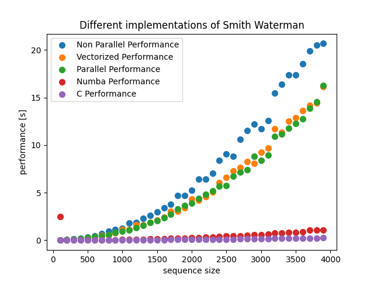

# Smith Waterman Algorithm
This project implements the Smith Waterman algorithm, a dynamic programming algorithm used for local sequence alignment. The algorithm compares two sequences and identifies the best local alignment between them, meaning the best matching subsequence, even if it is a small part of the larger sequence.

# Implementation
The project contains several implementations of the Smith Waterman algorithm in different programming languages.

These implementations can be found in the following files:

* c_align: C implementation of non-parallel matrix operations
* draftSw.py: Python implementation of non-parallel matrix operations
* nonParallelSw.py: Python implementation of non-parallel matrix operations
* parallelSw.py:  Python implementation of parallel matrix operations
* numpySw.py: Python implementation using NumPy for matrix operations
* numbaSw.py: Python implementation using Numba, a just-in-time (JIT) compiler for Python

# Benchmarking
In the Benchmarking.py we compare the runtime performance of Smith Watermann algorithm implemented with highly efficient methods.

# Python Winner: Numba implementation
Numba is a Python library that allows developers to write high-performance numerical code in Python without sacrificing readability or ease of development. It works by using a just-in-time (JIT) compiler to translate Python code into machine code at runtime. This means that Numba optimizes the code on the fly, as the code is being executed, rather than ahead of time.  

The key idea behind Numba is that it can generate optimized machine code that is specifically tailored to the input data types and shapes that the code is operating on. This is because Python is a dynamically-typed language, which means that the data types of variables are not known until runtime.  
By analyzing the data types of variables at runtime, Numba can generate machine code that is optimized for those data types.  

For numerical computations, Numba can be particularly effective because it can generate machine code that takes advantage of hardware-specific features such as SIMD instructions (which allow for parallel execution of the same instruction on multiple pieces of data) and multiple processor cores. This can lead to significant speedups over standard Python code, which typically runs on a single core and does not take advantage of SIMD instructions.  

In summary, Numba is a Python library that allows developers to write high-performance numerical code in Python by using a JIT compiler to translate the code into optimized machine code at runtime. By generating code that is specifically tailored to the input data types and shapes, Numba can achieve significant speedups over standard Python code, particularly for numerical computations.  

# Numpy implementation vs non-parallel implementation
Numpy is a highly optimized library for numerical operations in Python that allows for efficient array manipulation and mathematical operations. When used to calculate a score matrix for sequence alignment, Numpy's highly optimized array manipulation functions can significantly improve the runtime of the code.

One way that Numpy improves the runtime is by allowing for parallel computation of the score matrix. In the non-parallel implementation of the code, the score matrix is calculated using nested for-loops, which can be slow for large sequences. Numpy, on the other hand, can perform the same operations on entire arrays using highly optimized functions that take advantage of parallel processing on modern CPUs.

Another way Numpy improves the runtime is through its use of efficient memory management. In the non-parallel implementation, the score matrix is stored in a Python list, which can be slow due to the way that Python handles memory allocation. Numpy, on the other hand, uses highly optimized memory allocation strategies that can significantly reduce the amount of time spent on memory operations.

Overall, the use of Numpy for sequence alignment can significantly improve the runtime of the code due to its highly optimized array manipulation functions and efficient memory management.

# Parallel computation using CPU processor
The problem with using a CPU processor for parallel computation is that it's not optimized for this type of task. While CPUs are designed to execute instructions sequentially, one at a time, parallel computation involves breaking up a task into smaller pieces that can be executed simultaneously by multiple processors.

When using a CPU processor for parallel computation, it can become overloaded and struggle to keep up with the demands placed on it. This can lead to slower processing times, longer wait times, and reduced overall performance. Additionally, if the CPU processor doesn't have enough cores, or processing units, to handle the workload, it can result in bottlenecks and further slowdowns.

To address these issues, computer users often turn to specialized hardware such as GPUs, or Graphics Processing Units, which are specifically designed for parallel computation. GPUs have many more cores than CPUs, which allows them to execute multiple tasks simultaneously and process large amounts of data more quickly. By using specialized hardware, users can achieve faster processing times and better overall performance when working with parallel computations.
